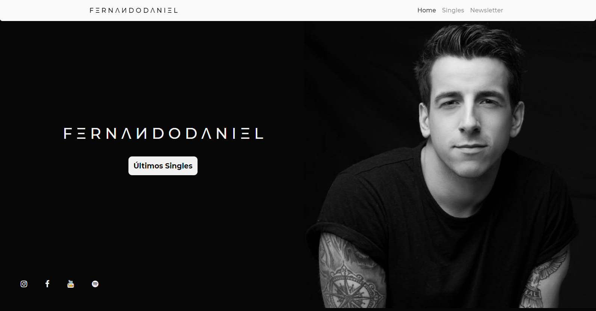

<h2 align="center">Aplicação Web - React.Js</h2>

 </a>

Website construído para um trabalho para a matéria de Web, onde era possível realizar a escolha de 2 temas: Música ou Notícias. Decidi escolher o tema de música e construir uma aplicação web dedicada ao cantor Fernando Daniel.

## Dependências 🧰

- Bootstrap
- React-Bootstrap
- React-Scroll
- Styled Components
- Font-Awesome

## Autor 🙋🏻‍♂️

💁🏻‍♂️ **Lucas Alvarenga**

* Meu Portfólio: https://alvarengadev.firebaseapp.com
* Github: [@Alvarenga-Dev](https://github.com/Alvarenga-Dev)

## Dá uma estrelinha! ⭐️

Copyright © 2019 [Lucas Alvarenga](https://github.com/Alvarenga-Dev).  
